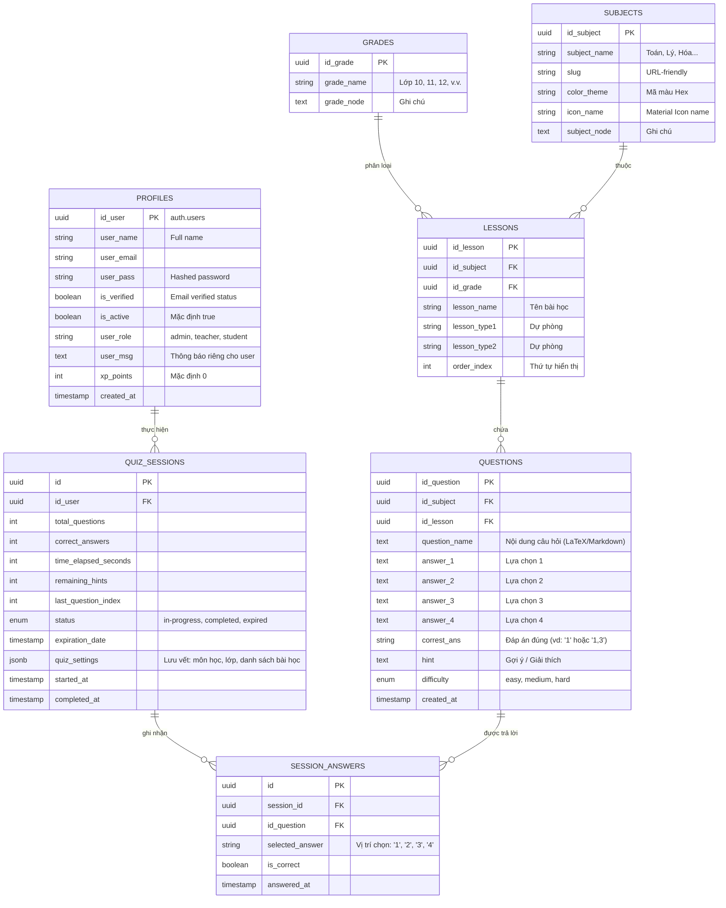

# Thiết kế cơ sở dữ liệu Supabase - PettyQuiz (Updated)

Tài liệu này mô tả chi tiết cấu trúc cơ sở dữ liệu (Database Design) được cập nhật dựa trên `data_structure_base.txt`, tối ưu hóa cho Supabase và đáp ứng đầy đủ các tính năng của website.

## 1. Sơ đồ thực thể (ERD)

## 2. Chi tiết các bảng & Quy tắc logic

### 2.1. Quản lý Người dùng (`profiles`)
- **`user_role`**: Phân quyền truy cập. `admin` có quyền quản lý nội dung, `teacher` tạo câu hỏi, `student` làm bài.
- **`user_msg`**: Hệ thống sẽ hiển thị một Pop-up thông báo ngay sau khi người dùng đăng nhập thành công nếu trường này không trống.
- **`is_active`**: Cơ chế khóa tài khoản tức thì từ phía quản trị.

### 2.2. Tổ chức Nội dung (`grades`, `subjects`, `lessons`)
- Đảm bảo tính phân cấp rõ ràng: Một bài học (`lesson`) thuộc về một môn học (`subject`) và một khối lớp (`grade`).
- Các trường `lesson_type` để mở rộng cho các loại bài học khác nhau (Lý thuyết, Thực hành, Ôn tập).

### 2.3. Cấu trúc Câu hỏi Flat (`questions`)
- Thay vì sử dụng bảng `options` riêng biệt, phiên bản này sử dụng 4 trường `answer_1-4` để đơn giản hóa việc nạp dữ liệu câu hỏi từ Excel/CSV.
- **`correst_ans`**: Hỗ trợ nhiều đáp án đúng nếu giá trị chứa dấu phẩy (vd: `1,4`). Logic frontend/backend sẽ tách chuỗi này để kiểm tra.

### 2.4. Phiên làm bài & Tự động lưu (`quiz_sessions`)
- **Cơ chế Auto-save**: Mọi hành động chọn đáp án sẽ được lưu vào `SESSION_ANSWERS` và cập nhật `last_question_index` trong `quiz_sessions`.
- **Logic Hint**: Số lượt gợi ý khởi tạo = `total_questions / 10`.

## 3. Bảo mật & Tối ưu hóa
- **RLS**: Phân quyền dựa trên `user_id` và `user_role`.
- **Indexes**: Đánh index cho `id_user`, `id_subject`, `id_lesson` và `status` của quiz session.
